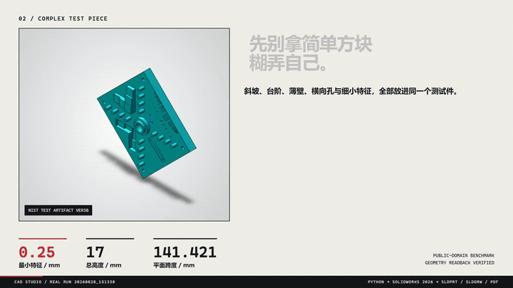

# SolidWorks Automation Skill

**AI Skill + MCP toolkit for reliable desktop CAD automation.**

让 Codex、Claude、Cursor 等 Agent 通过自然语言调用真实 CAD 软件，并对执行结果进行验证与追踪。

> Tool success is not treated as task success.

工具调用成功，不代表任务真的完成；需要 Review 的任务会经过结果验证后再交付。

[](https://opensource.org/licenses/MIT)
[](https://www.python.org/downloads/)
[](https://github.com/wzyn20051216/solidworks-automation-skill/releases)
[](https://github.com/wzyn20051216/solidworks-automation-skill)
[](mcp-server/README.md)
[](https://github.com/wzyn20051216/solidworks-automation-skill/actions/workflows/windows-release.yml)

```text
User → Agent (Codex / Claude / Cursor) → Skill / MCP → Execution Core → CAD → Artifacts + Evidence
```

AI 负责理解意图、查证 API、规划步骤；Execution Core 保证执行过程可追踪、可验证、失败可恢复。

---

## See It In Action

<p align="center">
  
</p>

一个真实流程：自然语言需求 → Agent 调用 Skill → SolidWorks 生成原生 `SLDPRT + SLDDRW` → 导出 PDF → 自动复核尺寸与证据。

| 案例 | 能力 | 状态 |
|---|---|---|
| [M6×1 真实螺纹孔](subskills/solidworks-threaded-holes/README.md) | Metric Tap Thread，重建后回读 | `verified` |
| [CNC 多圆角/倒角安装座](subskills/solidworks-fillet-chamfer-cnc/README.md) | 语义选边、可变半径、face/full-round/setback | `stable` |
| [标准渐开线直齿轮](references/gears.md) | 模数/齿数/压力角驱动实体 | `pilot` |

---

## Quick Start

三种入口**任选其一**即可，不需要同时启动。

### Option 1 — Skill（最简单）

```bash
npx github:wzyn20051216/solidworks-automation-skill
# 或
claude skill add https://github.com/wzyn20051216/solidworks-automation-skill
```

### Option 2 — MCP

```powershell
npm install -g @smithery/cli
smithery mcp add wzyn20051216/solidworks-automation-skill --client codex --config '{}'
```

### Option 3 — CAD Studio 桌面版

从 [GitHub Releases](https://github.com/wzyn20051216/solidworks-automation-skill/releases) 下载 Windows 安装包。

> **Choose one entry point. You do not need to run all three.**

| 入口 | 适合谁 | 需要 GUI | 典型用法 |
|---|---|---|---|
| **Skill** | 支持 skill 导入的 Agent 客户端 | 否 | 自然语言驱动 SolidWorks |
| **MCP** | Codex / Claude / Cursor / Windsurf 等 MCP 客户端 | 否 | Agent 自动 Tool Calling |
| **CAD Studio** | 需要图形界面管理项目/任务/预览/交付 | 是 | 桌面端提交任务 |

三者是**平级入口**，共用同一套能力清单（`capabilities.yaml`）、脚本与证据系统。安装后可用 `python scripts/cad_doctor.py` 做环境诊断；详细安装与 CLI 见 [`docs/CAD_STUDIO_USER_MANUAL.md`](docs/CAD_STUDIO_USER_MANUAL.md)。

---

## Why This Project

LLM 会规划，但常见的 AI CAD 自动化有几个真实问题：

- LLM 会规划，但不会真正操作桌面 CAD 软件
- Tool 返回 `success` 不代表任务真的完成
- CAD API 版本、环境、Backend 差异复杂
- 固定 Tool 集合覆盖不完所有工程需求
- Agent 执行过程通常不可追踪、不可审计

本项目的解法：

| 问题 | 方案 |
|---|---|
| 自然语言 → 真实操作 | Skill / MCP 接入真实 COM 与后端 |
| Tool success ≠ Task success | Verification-first completion |
| Backend 失败 | Backend Router + Recovery Decision |
| 能力缺失 | Capability Gap → 交还 Agent 查证 |
| 执行不可追踪 | 结构化 Trace |
| 是否可靠 | Golden Workflow Eval |

---

## Architecture

```text
User / Agent
  ↓
Skill / MCP
  ↓
Execution Core（Capability · Verification · Recovery Decision · Trace）
  ↓
Backend Router
  ↓
Python COM / C# / OCCT
  ↓
CAD Software
  ↓
Artifacts + Evidence
```

- **Root Skill** = 通用能力、规则与执行基础设施（连接、建模、审查、MCP）。
- **Subskills** = 专项领域工作流（工程图、螺纹孔、CNC 圆角、VibeCAD、AutoCAD），由 Root Skill 按需调用，不需要用户手动启动。
- **Execution Core** = 内部可靠执行层：统一状态、结果验证、失败恢复决策与执行追踪。它是内部实现，**不是独立服务、不需要用户启动**。
- **Capability Gap** = 找不到能力时结构化返回 `CAPABILITY_GAP`，交还 Agent 查证，而不是「做不了」：

  ```text
  Existing Tools → Tool Composition → Backend Fallback → Capability Gap
    → Agent 查 references / 官方 API / SDK → 最小实现 → Verification
  ```

  Execution Core 自身**不会自动联网执行未知代码**。

详细：[`docs/architecture/execution-core.md`](docs/architecture/execution-core.md)

---

## Reliability

V2 附带 **37 个 deterministic reliability scenarios**，覆盖正常执行、故障注入、后端回退、能力缺口与策略门禁。

| Metric | Current baseline |
|---|---|
| Nominal workflow | 11/11 first-pass |
| Injected false-completion cases | all detected |
| Escaped false completion | 0 in current deterministic benchmark |
| Regression suite | 740 passed / 1 skipped / 0 failed |

> 这是 **deterministic engineering benchmark**（Fake Handler/Reviewer + 故障注入），
> 不是生产 SLA 或真实用户成功率。详见 [`docs/architecture/v2-evaluation.md`](docs/architecture/v2-evaluation.md)。

---

## Capabilities & Status

| Category | 你能做什么 | 状态 |
|---|---|---|
| Modeling | 零件建模、草图/拉伸/旋转、齿轮、钣金、焊件 | `verified` + `pilot` |
| Assembly | 装配、Mate、干涉检查、爆炸视图 | `verified` |
| Drawing | GB/T 工程图、尺寸链、孔表、BOM | `verified` + `pilot` |
| Export | STEP / STL / IGES / PDF / DXF / DWG | `verified` |
| Motion | 运动算例、旋转马达、结果门禁 | `pilot` |
| FEA | CalculiX 线性/非线性求解编排与审计 | `pilot` |
| DFM / Routing | 制造复核、路由复核 | `pilot` |
| Surface / Mold | 受限 Loft/Sweep/Thicken、模具计划 | `pilot` |
| AutoCAD | DWG/DXF 二维绘图、图层/标注/预览 | `verified` / `pilot` / `blocked` |
| Open-format | OCCT 无头写入 STEP/BREP/STL/OBJ/GLB 等 | `verified` |

状态等级（`capabilities.yaml` 定义）：

| Status | 含义 |
|---|---|
| `verified` | 真机验证完成，可按已知范围使用 |
| `stable` | 长期回归覆盖 |
| `pilot` | 已实现但仍需人工复核 |
| `blocked` | 当前环境或能力不允许自动交付 |

真机基线：SolidWorks 2024 / 2026、AutoCAD 2024。未验证能力不会被包装成无人值守交付。

- 完整能力矩阵（每个能力的精确等级/版本/限制）→ [`capabilities.yaml`](capabilities.yaml)
- 领域工作流 → [`subskills/`](subskills/) · [`SUBSKILLS.md`](SUBSKILLS.md)

---

## No SolidWorks Installed?

没有 SolidWorks 时，部分开放格式任务仍可完成：

`STEP · IGES · BREP · STL · OBJ · GLB · DXF · SVG · PDF · PNG`

（通过 OCCT/OCP 隔离进程真实写入。）

但原生 `SLDPRT / SLDASM / SLDDRW` 仍需要合法 SolidWorks 环境。

---

## Examples

[`examples/`](examples/) 目录包含从基础零件到装配、工程图、Motion、FEA 的可运行示例。

---

## Documentation

| Topic | Link |
|---|---|
| MCP Setup | [`mcp-server/README.md`](mcp-server/README.md) |
| CAD Studio | [`docs/CAD_STUDIO_USER_MANUAL.md`](docs/CAD_STUDIO_USER_MANUAL.md) |
| Architecture | [`docs/architecture/execution-core.md`](docs/architecture/execution-core.md) |
| Reliability Eval | [`docs/architecture/v2-evaluation.md`](docs/architecture/v2-evaluation.md) |
| Capability Matrix | [`capabilities.yaml`](capabilities.yaml) |
| Subskills | [`SUBSKILLS.md`](SUBSKILLS.md) |
| API / Backend | [`references/`](references/) |
| Troubleshooting | [`references/troubleshooting.md`](references/troubleshooting.md) |

---

## Roadmap & Contributing

**Roadmap**：更广的真机验证 · 更可靠的能力路由 · 更好的 CAD Studio 可观测性 · 更多 verified 子技能 · 社区贡献工作流。

**Contributing**：新增能力时，先查 `capabilities.yaml`，优先复用现有 backend，新增 tests + evidence，不要把未验证 capability 标为 `verified`。详见 [`CONTRIBUTING.md`](CONTRIBUTING.md)。

---

## License & Community

[MIT](LICENSE) · [GitHub Issues](https://github.com/wzyn20051216/solidworks-automation-skill/issues) · [Star History](assets/star-history.svg)

---

## English

**SolidWorks Automation Skill** is an AI Skill + MCP toolkit for reliable desktop CAD automation. Codex, Claude, Cursor, and other agents drive real SolidWorks / CAD workflows through natural language, with verification, deterministic recovery decisions, and execution tracing. Three peer entry points — Skill, MCP, and CAD Studio — share one capability registry (`capabilities.yaml`). **Choose one; no extra runtime service is required.** See Quick Start above.

---

<sub>关注抖音 @balance. · 嵌入式开发、SolidWorks 自动化和 AI 辅助工程实践持续更新</sub>

### 装配干涉检查 API

`solidworks_interference_check` 使用 `IAssemblyDoc.InterferenceDetectionManager`，
通过 `GetInterferences()` 计算并读取 `IInterference.Components` 和体积，最后调用
`Done()`。隐藏实体和已忽略结果参与检查；同一个多实体零件内部的相交不计入。
计算失败、计数读取失败、数组数量不一致或结束检查失败均返回 `blocked`，不会误报零干涉。
抑制组件不参与计算；零结果仍需核对组件解析状态和设计意图。
离线回归覆盖调用顺序、失败处理和 SI 体积换算（26 项通过）。
SOLIDWORKS 2026 SP4.1（34.4.1）、Python 3.10 上已通过 MCP 实测正常返回；
该真机样例为零干涉，非零结果读取仍以离线回归为证据。
