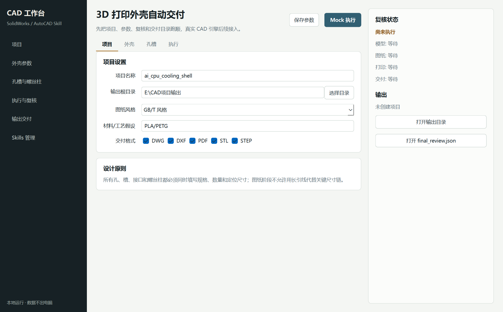

# CAD 自动化交付工作台桌面原型

这是 `solidworks-automation-skill` 的第一版本地桌面软件原型。

当前版本先跑通用户体验闭环:

```text
新建项目 -> 填写参数 -> 保存 JSON -> mock 执行 -> 生成复核报告和交付目录
```

真实 SolidWorks / AutoCAD 自动化会在后续版本接入同一条执行流水线。



## 安装依赖

```powershell
python -m pip install -r apps/desktop/requirements.txt
```

## 启动

```powershell
python apps/desktop/run.py
```

## 当前能力

- 本地项目目录创建。
- 3D 打印外壳参数表单。
- 孔、接口开孔、螺丝柱结构化表格。
- 输出 `project.json`、`parameters.json`。
- mock 生成模型、图纸、复核报告和交付说明。
- P0 规则检查结果可视化。

## 当前限制

- 还没有调用 SolidWorks COM。
- 还没有调用 AutoCAD COM。
- 生成的 CAD 文件是 mock 占位文件，不可用于制造。
- P0 检查当前基于参数完整性和文件结构，后续要接真实模型/图纸复核。
